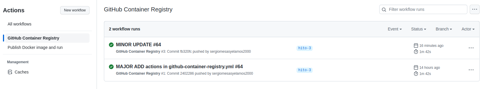
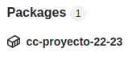
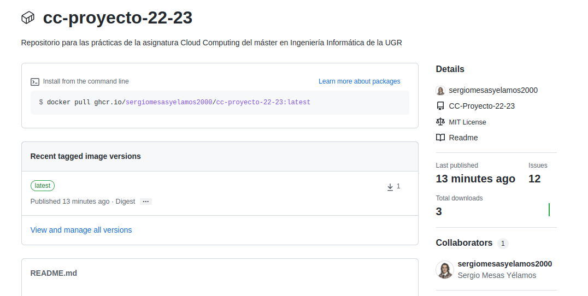

# GitHub Container Registry
GitHub Container Registry almacena imágenes de contenedores dentro de nuestra cuenta de GitHub y permite asociar una imagen a un repositorio, como es el caso de estudio. 
De esta manera, se puede consultar el paquete generado por el desplieque del contenedor en GitHub Container Registry [aquí](https://github.com/sergiomesasyelamos2000/CC-Proyecto-22-23/pkgs/container/cc-proyecto-22-23).

De manera similar que anteriormente, se ha creado un nuevo _Workflow_ para la actualización automática del código del contenedor desplegado, el cual puede consultarse [aquí](./../../../.github/workflows/github-container-registry.yml). Asimismo, los pasos seguidos son equivalentes a los utilizados para la creación del _workflow_ para [DockerHub](./hito3-update-and-push.md), salvo que en esta ocasión también se inicia sesión en el Container Registry:

```
- name: Login to GitHub Container Registry
        uses: docker/login-action@v1
        with:
          registry: ghcr.io
          username: ${{ github.actor }}
          password: ${{ secrets.GITHUB_TOKEN }}
```
En este caso, se indica el registro a utilizar mediante *_registry_* así como el usuario de GitHub empleado (obtenido de la variable *_github.actor_*) y la contraseña. Este último parámetro se trata de un _token_ proporcionado por GitHub al comienzo de cada ejecución de flujo de trabajo, creando de manera automática un _secret_ llamadO _GITHUB_TOKEN_ y que puede ser utilizado para autenticarse en un _workflow_.

Por consiguiente, se puede osbervar el correcto funcionamiento del _Action_:



y la visualización del _Package_:


