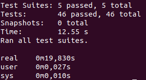
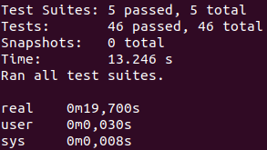
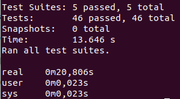

# Elección del contenedor base
Para llevar a cabo la elección del contenedor base a utilizar en función a las decisiones tomadas en el [Hito 2](./../hito2/hito2.md) y teniendo en cuentas tanto las herramientas como los _frameworks_ y lenguajes que se emplearán, es inevitable realizar una comparación de los diferentes tipos de imágenes que existen. De esta manera, los criterios de selección seguidos se han basado en el tamaño de la imagen, el tiempo de ejecución, funcionalidad y características incluidas. Por consiguiente, dado que el lenguaje utilizado es *node* se han contemplado las siguientes alternativas:

 - Imagen node:version
 - Imagen node:version-alpine
 - Imagen node:version-slim

## Imagen node:version
Se trata de la imagen oficial de *node*, la cual contiene todas las dependencias de node y ofrece soporte para una amplia gama de versiones. Además, está diseñaad y mantenida por un equipo de _Node_ dedicado ofreciendo la posibilidad de de usarse tanto como un contenedor para iniciar la aplicación como base para la construcción de otras imágenes. Se recomienda para aquellas personas que no tienen ningún conocimiento sobre los paquetes o requisitos necesarios y deseen instalarlos todos. Por lo tanto, se creará una imagen con base en la imagen oficial de _Node_ de la siguiente manera:

```
FROM node:14.20 As development

WORKDIR /usr/src/app

COPY backend/package*.json ./

RUN npm install && npm update && npm cache clean --force

COPY backend/. ./

CMD ["npm", "run", "test"] 
```

Por tanto, una vez creada la imagen se medirá el tiempo de ejecución a través del siguiente comando:

```
time docker run sergiomesasyelamos2000/cc-proyecto-22-23:node
```

Obteniendo el siguiente resultado:



Tal y como se puede observar, el contenedor ha tardado 19.830 segundos en ejecutarse.

Además, esta imagen posee un tamaño de 1.51 GB:

```
(base) smyelamos@localhost:~$ docker images
REPOSITORY                                 TAG            IMAGE ID       CREATED          SIZE
sergiomesasyelamos2000/cc-proyecto-22-23   node           6cb096385b58   3 hours ago      1.51GB
```

## Imagen node:version-alpine
Esta imagen está basada en el popular proyecto Alpine Linux cuyop tamaño es mucho más pequeño que la mayoría de las imágenes base de distribución y, por lo tanto, conduce a imágenes mucho más ligeras en general. Esta variante es muy recomendable cuando se desea que el tamaño final de la imagen sea lo más pequeño posible puesto el usuario puede indicar en el archivo Dockerfile únicamente aquellas dependencias y paquetes que necesita.

```
FROM node:14.20-alpine As development

WORKDIR /usr/src/app

COPY backend/package*.json ./

RUN npm install && npm update && npm cache clean --force

COPY backend/. ./

CMD ["npm", "run", "test"] 
```

Por tanto, una vez creada la imagen se medirá el tiempo de ejecución a través del siguiente comando:

```
time docker run sergiomesasyelamos2000/cc-proyecto-22-23:node-alpine
```

Obteniendo el siguiente resultado:



Tal y como se puede observar, el contenedor ha tardado 19.700 segundos en ejecutarse.

Además, esta imagen posee un tamaño de 712 MB, por lo que posee un tamaño muy inferior al de la imagen anterior:

```
(base) smyelamos@localhost:~$ docker images
REPOSITORY                                 TAG            IMAGE ID       CREATED          SIZE
sergiomesasyelamos2000/cc-proyecto-22-23   node-alpine    d8fbb3ea1e98   44 minutes ago   712MB

```

## Imagen node:version-slim
Esta imagen no contiene los paquetes comunes incluidos en la iamgen por defecto y solo contiene los paquetes mínimos necesarios para ejecutar _node_. Además, se encuentra dirigida a entornos y proyectos en los que la restricción de espacio es extremadamente importante, por lo que tiene ciertas similitudes con la anterior. 

```
FROM node:14.20-slim As development

WORKDIR /usr/src/app

COPY backend/package*.json ./

RUN npm install && npm update && npm cache clean --force

COPY backend/. ./

CMD ["npm", "run", "test"] 
```

Por tanto, una vez creada la imagen se medirá el tiempo de ejecución a través del siguiente comando:

```
time docker run sergiomesasyelamos2000/cc-proyecto-22-23:node-slim
```

Obteniendo el siguiente resultado:



Tal y como se puede observar, el contenedor ha tardado 20.806 segundos en ejecutarse.

Además, esta imagen posee también un tamaño de 712 MB:

```
(base) smyelamos@localhost:~$ docker images
REPOSITORY                                 TAG            IMAGE ID       CREATED          SIZE
sergiomesasyelamos2000/cc-proyecto-22-23   node-slim      d8fbb3ea1e98   44 minutes ago   712MB


```
## Comparativa
Una vez creadas las tres imágenes anteriores, se condtruirá una tabla comparativa en base a los requisitos anteriormente comentados:


| Imagen | Size | Ejecución  |
|:---------:|:---------:|:--------:|
| node |  1.51GB | 19.830s |
| node:alpine | 712MB | 19.70s |
| node:slim |  712MB | 20.806s |


Por consiguiente, tal y como se puede apreciar en la imagen anterior, la iamgen de _node_ posee un tamaño muy superior que el resto ya que contiene una gran cantidad de paquetes que en nuestro caso no son necesarios. Tanto es así que conforme se ha ido simplificando el número de paquetes de la imagen, esta se ha vuelto significativamente más liviana. De esta manara, dado que la imagen de _slim_ y de _alpine_ poseen el mismo tamaño, si observamos el tiempo de ejecución se puede apreciar que la imagen de _alpine_ es la que menos tiempo tarda aunque la diferencia es mínima.

## Conclusión
En conslusión, se elige la imagen de node para _alpine_ tanto para la realización de la imagen como del contenedor de pruebas ya que se trata de una imagen ligera, desarrollada y mantenida por una gran comunidad de desarrolladores y que además cuenta con el paquete _npm_ y _corepack_ configurados, ambos necesarios para la ejecución del proyecto.