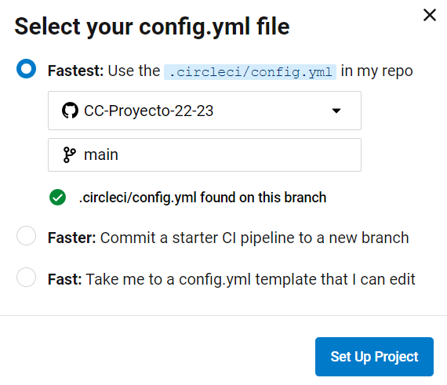
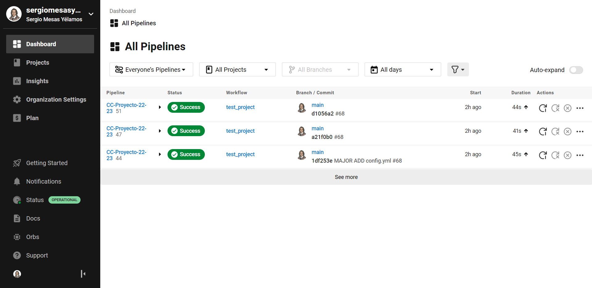
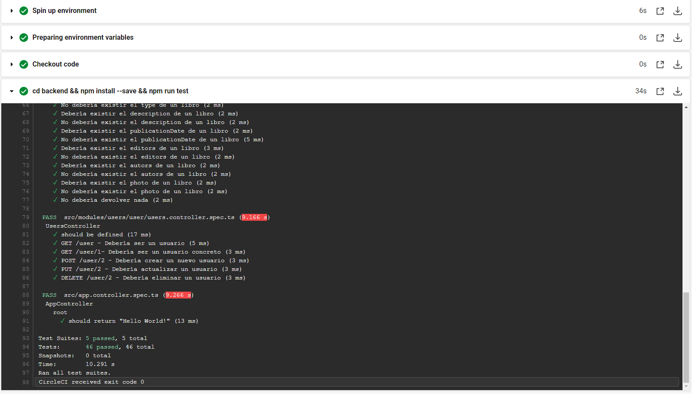

# Elección del sistema de Integración Continua (CI)

El objetivo de este hito es preparar el proyecto para la integración continua. Para ello se han valorado diferentes alternativas. Dado que se necesita nodejs para ejecutar el framework de test utilizado, el principal criterio de elección ha sido buscar un sistema de integración continua que admita nodejs, que sea sencillo y que ofrezca rapidez para la ejecución de los tests. Por consiguiente, para la elección del sistema CI se ha realizado una búsqueda para ver qué sistemas existen, qué ofrecen, diferencias, lenguajes y funcionalidades que soportan. De esta manera, se han encontrado los siguientes:

## Travis
Travis CI fue la primera herramienta de CI como servicio. Introdujo un nuevo enfoque para crear código en la nube. Esta herramienta de CI permite al usuario registrarse, vincular su repositorio, compilar y probar sus aplicaciones.

La herramienta Travis CI puede integrarse fácilmente con los repositorios comunes en la nube como GitHub y Bitbucket. Ofrece muchas opciones de CI automatizadas que eliminan la necesidad de un servidor dedicado, ya que el servidor Travis CI está alojado en la nube lo que permite probar en diferentes entornos, en varias máquinas, ejecutándose en diferentes sistemas operativos.

Travis ofrece la posibilidad de ejecutar un workflow en su plataforma después de realizar _push_ en nuestro repositorio de GitHub de manera automática. Para ello es necesario crear un nuevo archivo llamado _travis.yml_ en el directorio raíz de nestro repositorio y conectar la cuenta de Travis con el repositorio de GitHub. Adicionalmente, también brinda la posibilidad de testear varias versiones del lenguaje, lo que puede ser realmente interesante para comprobar que nuestro código funciona en diferentes versiones de nodejs y ver como se comporta.

Sin embargo,presenta la desventaja de que es su rendimiento no es muy alto, los trabajos tardan más de lo habitual en ejecutarse y no es posible elegir los recursos a diferencia de otras plataformas de integración. Además, acutalmente se trata de una herramienta de pago por lo que dicha opción queda descartada por completo.

## Circle CI

De manera similar al anterior, también permite ejecutar Nodejs, contenedores...Además, Circle CI no solamente es utilizado para la ejecución de pruebas de código sino que permite hacer despliegues y cualquier tipo de trabajo en la nube. Esta plataforma ofrece una característica muy interesante que la diferencia del resto, los _orbs_. Los _orbs_ son fragmentos de código reutilizables que permiten acelerar el proceso de configuración y ejecución de nuestros tests sin necesidad de escribir gran cantidad de código. Circle Ci ofrece una respuesta rápida utilizando un plan totalmente gratuito a pesar de que se restringe en gran medida el número de peticiones que se pueden llegar a realizar.

De esta manera, una vez que nos hemos registrado en [Circle-CI](https://circleci.com/), para poder comenzar el proceso de integración continua basta con conectar nuestro repositorio de Github con la plataforma mediante un fichero de configuración en el repositorio, el cual puede visualizarse en el siguiente [enlace](./../../../.circleci/config.yml). 



Una vez seleccionado el repositorio, se nos abre un dashboard para poder ver los _workflows_ que se han ejecutado y en qué rama:



Se debe destacar que cada vez que realicemos un commit en el repositorio, lanzará los tests, consumiendo créditos. Para evitar esto, debemos indicar en el mensaje del commit `[skip ci]` para que no se ejecute la acción.

Por consiguiente, para que esta herramienta de integración continua funcione adecuadamente es necesario crear un archivo llamado _config.yml_ en la carpeta _.circleci_ de nuestro repositodio de GitHub, tal y como se puede ver a continuación:

```
version: 2.1

jobs:
  build:
    docker:
      - image: sergiomesasyelamos2000/cc-proyecto-22-23:latest
    steps:
      - checkout
      - name: Running tests
      - run: cd backend && npm install --save && npm run test

workflows:
  test_project:
    jobs:
      - build
```

A continuación, se describirá el arvhivo de configuración anterior. En primer lugar, hay que especificar la versión de Circle-CI a utilizar, en este caso se ha hecho uso de la versión 4.0.1 puesto que es la última disponible actualmente y otorga muchas funcionalidades nuevas, como la de los `orbs` comentados anteriormente.

Posteriormente, se han indicado los `jobs` o trabajos a realizar. En este caso, dado que utilziaremos Docker, se han incluido los campos `build` y `docker` para poder incluir dentro de este la imagen que queramos emplear, es decir, la última imagen que comprueba y pasa nuestros tests.

Más tarde, se indican una serie de `steps` a realizar con la imagen construida y se ejecuta la acción `checkout`, la cual nos permite ejecutar comandos dentro del contenedor sin necesidad de por ejemplo, crear y montar volúmenes. Por último, dentro del apartado `run`, se ejecutan los comandos deseado, en este caso la tarea de ejecución de test mediante la instrucción `npm run test`. 
Tal y como se puede observar en la siguiente imagen, todo ha funciona correctamente:



## GitHub Action

Otra plataforma que se ha utilizado para la integración continua es Github mediante el uso de las GitHub Actions, la cual ha sido empleada en el hito anterior para el despliegue automatizado del contenedor de pruebas en GitHub Container Registry y DockerHub. Por consiguiente, para este hito se ha creado el siguiente _workflow_ : [run-docker-test.yml](./../../../.github/workflows/github-actions.yml).

Una de las características interesantes de las GitHub Actions es que podemos controlar el proceso de ejecución de los _workflows_ y tener un control total del proceso de integración continua. Además, nos permite utilizar otras _actions_ dentro de la nuestra. Sin embargo, las ejecuciones son mas lentas y se requiere de más pasos para configurar el workflow correctamente a diferencia de otras plataformas como Circle CI.

A continuación, se analizará el _GitHub Action_ creado:

```
name: Run Tests

on:
  workflow_run:
    workflows: ["GitHub Container Registry"]
    branches: [main]
    types:
      - completed

jobs:
  run_test:
    runs-on: ubuntu-latest
    steps:
      - uses: actions/checkout@v2
      - name: Lanzar Tests CI
        run:
          docker run -t -v `pwd`:/app/test sergiomesasyelamos2000/cc-proyecto-22-23
```

Se debe destacar que esta _action_ únicamente se ejecutará después de que la _action_ que se encargaba de construir y subir la imagen en GitHub Container Registry y DockerHub (realizada en el hito anterior) tenga éxito. Eso se consigue gracias a `workflow_run`, puesto que le indicamos mediante la clave `workflows` el nombre del _workflow_ encargado de subir la imagen. Adicionalmente, a través de la clave `branches` se indica que est _action_ solo se ejecutará cuando se haya ejecutado el _workflow_ del que depende en la rama _main_. Por último, se le indica mediante la palabra `completed` que se inicie cuando el _workflow_ anteriormente comentado haya terminado.

Por otro lado, si el _workflow_ del que depende ha tenido éxito se ejecutarán dos `steps`, el primero de ellos realzia un `checkout` del repositorio y el segundo  ejecuta la imagen a través de Docker con los tests creados en hitos anteriores.

En conclusión, se ha llevado a cabo este procesamiento pues no es coherente ejecutar la imagen Docker si esta ha sido actualizada o si presenta algún tipo de error. El resultado de la ejecución de este _workflow_ con los tests automatizados puede consultarse [aqui](https://github.com/sergiomesasyelamos2000/CC-Proyecto-22-23/actions/workflows/github-actions.yml), aunque en la siguiente imagen se muestra el correcto funcionamiento de esta GitHub Action:


## Jenkins
Jenkins es una herramienta de automatización de código abierto escrita en Java con complementos construidos para la integración continua. Jenkins se utiliza para construir y probar sus proyectos de software continuamente, lo que facilita a los desarrolladores la integración de cambios en el proyecto y facilita a los usuarios obtener una nueva compilación. También le permite entregar continuamente su software mediante la integración con una gran cantidad de tecnologías de prueba e implementación. Sin embargo, posee diferentes inconvenientes puesto que requiere que se instale como una aplicación del sistema, no es asíncrona y necesita que se ejecute en una imagen de docker mediante el uso de plugins que dificultan la configuración.

# Conclusiones

Tras la utilización de varias plataformas para la integración continua, se pueden extraer las siguientes conclusiones:

- Todas las plataformas utilizadas son aceptables para trabajar con proyectos de un tamaño pequeño, ya que ofrecen bastante características para lograr un sistema de integración continua eficiente, sencillo y rápido.

- Basándonos en la facilidad de uso y la sencillez de la configuración, Circle CI se corona como la mejor plataforma de integración continua ya que el uso de `orbs` facilita y agiliza el proceso de integración continua de manera gratuita.

- Se hace uso de los contenedores generados en las diferentes iteraciones anteriores mediante el uso de CI, más concretamente en DockerHub y GitHub Container Registry, por lo que cada vez que se genera un nuevo contenedor, se ejecutan los distintos tests automáticamente.

- De nuevo, se emplea el gestor de tareas (recordemos que se utilziada *npm*), el cual resulta de gran utilidad puesto que permite lanzar las tareas de manera rápida y sencilla, pudiendo configurarlo en el ya conocido [package.json](./../../../backend/package.json).

Por consiguiente, se ha escogido Circle CI como herramienta de Integración Continua.