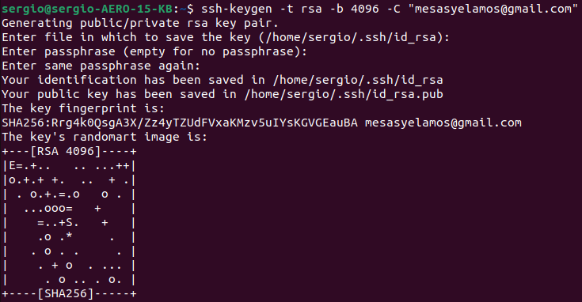

## :rocket: Preparación inicial del entorno de trabajo :rocket: 

Este documento versa sobre los pasos a seguir para la correcta preparación del entorno de trabajo empleando las herramientas de git y GitHub, todo ello con el objetivo de utilziar de manera correcta los disintos repositorios y alcanzar los requirimientos necesarios para las diferentes entregas.


### Creación de los repositorios

- [Fork del Repositorio de Cloud Computing 22-23](https://github.com/sergiomesasyelamos2000/CC-22-23): Fork realizado al repositorio de la asignatura de Cloud Computing a mi cuenta de GitHub.


- [Repositorio del Proyecto](https://github.com/sergiomesasyelamos2000/CC-Proyecto-22-23): Repositorio que contiene el proyecto a desarrollar en la asignatura así como todos los elementos necesarios, entre ellos la licencia. En este caso, se ha seleccionado la licencia _MIT_ ya que implica una baja cantidad de limitaciones y permite su modificación.

Una vez realizado lo anterior, se puede clonar dicho repositorio desde GitHub a local mediante el comando:

```
$ git clone https://github.com/sergiomesasyelamos2000/CC-Proyecto-22-23
```
### Configuración de la cuenta personal de GitHub
Con el objetivo de poder identificarnos de una mejor manera dentro de la plataforma, se ha añadido una imagen de perfil así como una descripción explicativa sobre nosotros y sobre el propio repositorio personal, facilitando con ello el seguimiento de este:


### Configuración de nombre y correo electrónico para que apareza en los commits


A continuación, se deberán asociar tanto un correo electrónico como un usuario a git, que nos identificará cuando se realizcen cambios en el repositorio. Para ello, deberemos hacer uso de los siguientes comandos:

```
$ git config --global user.name "Sergio Mesas Yelamos"
$ git config --global user.email mesasyelamos@gmail.com
```

Una vez realizado lo anterior, si empleamos el comando siguiente, podemos ver que los cambios han sido modificados correctamente:

```
$ git config --list
```
El resultado de la orden anterior es:


### Creación de claves y subida de clave pública a GitHub

Posteriormente, se creará un par de claves público/privada para poder conectar con el repositorio de GitHub mediante SSH.
En primer lugar, se deberán generar las claves haciendo uso del siguiente comando:

```
$ ssh-keygen -t rsa -b 4096 -C "mesasyelamos@gmail.com"
```

Destacar que el parámetro _-t rsa_ indica que el tipo de algoritmo para la generación de la clave pública será _rsa_ (aunque se trata de un algoritmo antiguo es el más utilizado) mientras que el parámetro _-b 4096_ se refiere al tamaño de _bits_ de la clave.

El comando anterior, nos arrojará el siguiente resultado, el cual nos informa que las claves han sido generadas correctamente y almacenadas en la carpeta _.ssh_:



Además, se deben añadir las claves anteriormente generadas al agente _ssh_. Para ello, accederemos en como superadmiinistrador mediante el comando:

```
$ sudo -s -H 
```

Acto seguido, iniciaremos el agente _ssh_ en segundo plano:

```
$ eval "$(ssh-agent -s)"
```

Por último, se agregará la clave privada al agente _ssh_ a través del comando:

```
$ ssh-add /home/sergio/.ssh/id_rsa
```

Seguidamente, para poder autenticarnos como usuarios vía _ssh_, en nuestro perfil de GitHub (en el apartado _Settings_ > _SSH and GPG keys_) deberemos añadir la clave pública almacenada en el fichero _/home/migue/.ssh/id_rsa.pub_, tal y como podemos observar en la siguiente Figura:


Una vez agreagada, nos aparecerá de la siguiente manera:


Para comprobar que el proceso de configuración se ha realizado correctamente, realizaremos una prueba de conexión mediante el siguiente comando:

```
$ ssh -T git@github.com
```

A continuación, con el objetivo de firmar las claves, nos pedirá la contraseña introducida en el paso de generación de claves. En caso de no producirse ningún error, la salida debe ser similar a la siguiente Figura:


### Activar el segundo factor de autenticación

Por otro lado, en cuanto a la configuración de la autenticación de dos factores, deberemos dirigirnos al apartado de _Settings_ > _Password and authentication_ y habilitar la sección _Two-factor authentication_. En este caso, se ha seleccionado el envío de un código a través de un mensaje de texto (SMS) como segunda forma de autenticación de GitHub.

